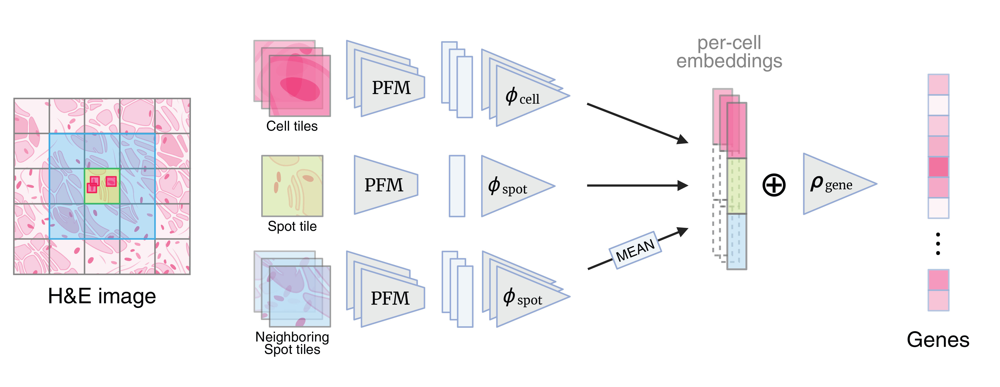

# DeepSpot2Cell: Predicting Virtual Single-Cell Spatial Transcriptomics from H&E images using Spot-Level Supervision

**Authors**: Kalin Nonchev, Glib Manaiev, Viktor Hendrik Koelzer, and Gunnar Rätsch

The preprint is available [here](https://www.biorxiv.org/content/10.1101/2025.09.23.678121v1).



**DeepSpot2Cell predicts virtual single-cell spatial transcriptomics as follows:** (1) During training, the model takes as input (i) the cropped cell tile defined by the segmentation mask, (ii) the full spot tile covering containing the cell (55μm), and (iii) the neighboring spot tile(s). All tiles are first processed through a pathology foundation model (PFM) before being used to train the model to regress spot-level gene expression; (2) During inference, the model takes as input only the cell tile of interest along with (ii) and (iii), again after PFM processing and predicts the virtual transcriptomic profile at the cell level.

## Setup

```bash
conda env create -f environment.yaml
conda activate deepspot2cell
pip install -e .
```

## Getting Started

You can follow the three-part tutorial notebook series to get started with DeepSpot2Cell:


- [Preprocessing tutorial](tutorials/GettingStartedWithDeepSpot2Cell_1_preprocessing.ipynb)

- [Training tutorial](tutorials/GettingStartedWithDeepSpot2Cell_2_training.ipynb)

- [Inference tutorial](tutorials/GettingStartedWithDeepSpot2Cell_3_inference.ipynb)

## Pathology Foundation Models

DeepSpot2Cell can be used with different pathology foundation models. The ones it was tested with can be found at their respective Hugging Face pages:

[UNI weights](https://huggingface.co/MahmoodLab/UNI)

[Hoptimus0 weights](https://huggingface.co/bioptimus/H-optimus-0)

[Phikon v2 weights](https://huggingface.co/owkin/phikon-v2)

Please adjust the model paths in your config files accordingly.

## HEST-1k Dataset

The HEST-1k dataset and its documentation can be found [here](https://huggingface.co/datasets/MahmoodLab/hest).

Please adjust the paths in your config files accordingly.

## Citation

If you found our work useful, please cite:

```bibtex
@article{Nonchev2025.09.23.678121,
    author = {Nonchev, Kalin and Manaiev, Glib and Koelzer, Viktor H and Rätsch, Gunnar},
    title = {DeepSpot2Cell: Predicting Virtual Single-Cell Spatial Transcriptomics from H\&E images using Spot-Level Supervision},
    year = {2025},
    doi = {10.1101/2025.09.23.678121},
    journal = {bioRxiv}
}
```

