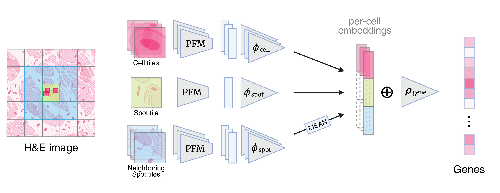

# DeepSpot2Cell: Predicting Virtual Single-Cell Spatial Transcriptomics from H&E images using Spot-Level Supervision

[](https://opensource.org/licenses/MIT)
[](https://www.python.org/downloads/)
[](https://www.biorxiv.org/content/10.1101/2025.09.23.678121v1)

**Authors**: Kalin Nonchev*, Glib Manaiev*, Viktor Hendrik Koelzer+, Gunnar Rätsch+

The preprint is available [here](https://www.biorxiv.org/content/10.1101/2025.09.23.678121v1).



**DeepSpot2Cell predicts virtual single-cell spatial transcriptomics as follows:** (1) During training, the model takes as input (i) the cropped cell tile defined by the segmentation mask, (ii) the full spot tile covering containing the cell (55μm), and (iii) the neighboring spot tile(s). All tiles are first processed through a pathology foundation model (PFM) before being used to train the model to regress spot-level gene expression; (2) During inference, the model takes as input only the cell tile of interest along with (ii) and (iii), again after PFM processing and predicts the virtual transcriptomic profile at the cell level.

## News
- [06.2026] Meet the next generation of DeepSpot: [DeepSpot-M: a multimodal foundation model for transcriptome-wide virtual spatial transcriptomics from histology](https://www.medrxiv.org/content/10.64898/2026.06.19.26356060v1). [Code.](https://github.com/ratschlab/DeepSpotM)
- [01.2026] Invited talk at 10x Genomics Single Cell & Spatial Discovery Symposium, Boris Laukas, 2026, Bern, Switzerland
- [12.2025] Contributed talk at [NeurIPS 2025 Workshop on Multi-modal Foundation Models and Large Language Models for Life Sciences](https://nips2025fm4ls.github.io/), 2025, San Diego, USA
- [10.2025] DeepSpot2Cell: Predicting Virtual Single-Cell Spatial Transcriptomics from H&E images using Spot-Level Supervision at NeurIPS 2025 Imageomics.

## Setup

```bash
conda env create -f environment.yaml
conda activate deepspot2cell
pip install -e .
```

## Getting Started

You can follow the three-part tutorial notebook series to get started with DeepSpot2Cell:


- [Preprocessing tutorial](tutorials/GettingStartedWithDeepSpot2Cell_1_preprocessing.ipynb)

- [Training tutorial](tutorials/GettingStartedWithDeepSpot2Cell_2_training.ipynb)

- [Inference tutorial](tutorials/GettingStartedWithDeepSpot2Cell_3_inference.ipynb)

## Pathology Foundation Models

DeepSpot2Cell can be used with different pathology foundation models. The ones it was tested with can be found at their respective Hugging Face pages:

[UNI weights](https://huggingface.co/MahmoodLab/UNI)

[Hoptimus0 weights](https://huggingface.co/bioptimus/H-optimus-0)

[Phikon v2 weights](https://huggingface.co/owkin/phikon-v2)

Please adjust the model paths in your config files accordingly.

## HEST-1k Dataset

The HEST-1k dataset and its documentation can be found [here](https://huggingface.co/datasets/MahmoodLab/hest).

Please adjust the paths in your config files accordingly.

## Papers Citing DeepSpot2Cell

<!-- CITATIONS:START -->
1. Ninghui Hao, Xinxing Yang, Boshen Yan, Dong Li, Junzhou Huang, Xintao Wu, E. S. Ruiz, Arlene Ruiz de Luzuriaga, Chen Zhao, and Guihong Wan "Histopathology-centered computational evolution of spatial omics: integration, mapping, and foundation models." *Briefings in Bioinformatics* (2026). [DOI](https://doi.org/10.1093/bib/bbag387)
2. Ninghui Hao, Xinxing Yang, Boshen Yan, Dong Li, Junzhou Huang, Xintao Wu, E. S. Ruiz, Arlene Ruiz de Luzuriaga, Chen Zhao, and Guihong Wan "Histopathology-centered Computational Evolution of Spatial Omics: Integration, Mapping, and Foundation Models." *arXiv.org* (2026). [DOI](https://www.semanticscholar.org/paper/ab1a5c1f63e9af7d8a5576f25debcb69f3b3021a)
<!-- CITATIONS:END -->

*This list is automatically updated weekly via [GitHub Actions](.github/workflows/update-citations.yml) using the [Semantic Scholar](https://www.semanticscholar.org/) and [OpenCitations](https://opencitations.net/) APIs.*

## Related Projects

- [DeepSpot](https://github.com/ratschlab/DeepSpot) — Predicts spatial transcriptomics from H&E images at spot-level (Visium) and single-cell (Xenium) resolution. Includes 8 TB of predicted TCGA data.
- [AESTETIK](https://github.com/ratschlab/aestetik) — AutoEncoder for learning multi-modal spatial transcriptomics representations.

## Citation

If you found our work useful, please cite:

```bibtex
@article{nonchev2025deepspot2cell,
  title={DeepSpot2Cell: Predicting Virtual Single-Cell Spatial Transcriptomics from H\&E images using Spot-Level Supervision},
  author={Nonchev, Kalin and Manaiev, Glib and Koelzer, Viktor H and R{\"a}tsch, Gunnar},
  journal={bioRxiv},
  pages={2025--09},
  year={2025},
  publisher={Cold Spring Harbor Laboratory}
}
```


#### NB: Computational data analysis was performed at Leonhard Med (https://sis.id.ethz.ch/services/sensitiveresearchdata/) secure trusted research environment at ETH Zurich.

